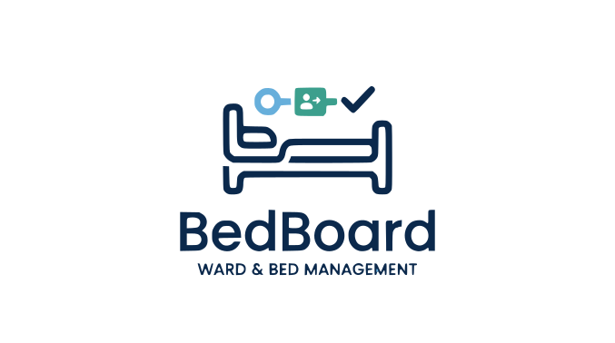

<div align="center">
  

# BedBoard

A local-first emergency board for bed occupancy and patient flow.

<p align="center">
  
  
  
  
  
</p>
</div>

---

BedBoard is a standalone management system for emergency departments, with role-based access, real-time synchronization, and admin-managed security and UI settings.

## Repository Layout

| Path | Purpose |
| :--- | :--- |
| backend/ | Go API server, business logic, persistence, and embedded frontend assets |
| frontend/ | React + Vite dashboard and admin interface |
| .github/workflows/ | CI and signed release automation |
| scripts/ | Utility scripts for local/CI asset synchronization |
| tools/ | Developer utilities (for example, icon generation) |

## Community and Governance

- Contribution guide: CONTRIBUTING.md
- Code of conduct: CODE_OF_CONDUCT.md
- Issue templates: .github/ISSUE_TEMPLATE/

When reporting bugs or requesting features, use the provided GitHub templates for faster triage.

## Technology Stack

| Component | Technology |
| :--- | :--- |
| Backend | Go, GORM, SQLite |
| Frontend | React, Vite |
| Transport | REST, Server-Sent Events (SSE) |
| Signing | Sigstore Cosign (keyless) |

## Core Features

- Realtime synchronization via SSE endpoint /api/stream.
- Full patient lifecycle: register, triage, assign, consult, archive.
- Bed states: free, occupied, cleaning, alert.
- Role-based access for admin, user, triage, reception, dechocage.
- White-label branding and localization (French, English, Arabic).
- Security controls and health checks in-app.
- Gotify integration with encrypted token support.
- Outbound SMS/WhatsApp webhook channels with acknowledgement tracking.
- Patient timeline and operational KPIs (SLA, waits, consultations/hour).
- Bed assignment dropdown enriched with patient tags (type, triage, status).
- Bedside patient workflow controls directly from bed cards: imaging, waiting results, discharge ready.
- Keyboard bedside workflow shortcuts on selected bed: I (imaging), B (bilan/waiting results), S (discharge ready).
- Extended patient categories including urgences differees.

## Quick Start

```bash
npm --prefix frontend ci
npm --prefix frontend run build
bash scripts/prepare-backend-assets.sh
go run ./backend
```

Default URL: http://localhost:8080

> First login on a fresh database:
> Username: admin
> Password: ChangeMe!123
>
> Change credentials immediately after login.

## Administration and Security

### Settings Areas

- Parameters: app name, logo, locale, user management.
- Security: bootstrap credentials, cookie/hsts/proxy controls, health checks.
- Integrations: Gotify plus SMS/WhatsApp webhook channels and acknowledgement log.
- Operations: backup/restore and audit management.

### Security Keys

| Key | Description |
| :--- | :--- |
| security.admin_init_username | Bootstrap admin username |
| security.admin_init_password | Bootstrap admin password |
| security.force_secure_cookie | Force secure session cookies |
| security.trust_proxy_headers | Trust X-Forwarded-* headers |
| security.enable_hsts | Enable HSTS policy |
| security.hsts_max_age | HSTS max-age value |
| security.hsts_include_subdomains | HSTS includeSubDomains flag |
| security.hsts_preload | HSTS preload flag |
| security.gotify_token_enc_key | Encryption key for Gotify token |
| security.proxy_enabled | Enable outbound proxy for alert integrations |
| security.proxy_url | Outbound proxy URL |
| security.proxy_username | Outbound proxy username |
| security.proxy_password | Outbound proxy password (encrypted) |
| security.alert_callback_signature_required | Require HMAC signature for public alert callback |
| security.alert_callback_secret | Shared secret for callback signature verification |
| security.alert_callback_ip_allowlist | Allowed source IP/CIDR list for callback endpoint |
| integrations.sms.enabled | Enable SMS outbound channel |
| integrations.sms.webhook_url | SMS gateway webhook URL |
| integrations.sms.recipient | SMS default recipient |
| integrations.whatsapp.enabled | Enable WhatsApp outbound channel |
| integrations.whatsapp.webhook_url | WhatsApp gateway webhook URL |
| integrations.whatsapp.recipient | WhatsApp default recipient |

### Security and Operations Endpoints

- Security health: GET /api/admin/security/health
- Public UI config: GET /api/public/ui-config
- Admin UI config: GET /api/admin/ui/config, POST /api/admin/ui/config
- Gotify config: GET /api/admin/integrations/gotify, POST /api/admin/integrations/gotify
- Gotify test: POST /api/admin/integrations/gotify/test
- Alert channels config: GET/POST /api/admin/integrations/alerts/channels
- Alert channels test: POST /api/admin/integrations/alerts/channels/test
- Alert notifications feed: GET /api/admin/integrations/alerts/notifications
- Alert acknowledgement (admin): POST /api/admin/integrations/alerts/notifications/ack
- Alert acknowledgement (gateway callback): POST /api/integrations/alerts/ack

Public callback security headers (when signature verification is enabled):

- `X-BedBoard-Timestamp`: Unix seconds timestamp
- `X-BedBoard-Signature`: `sha256=<hex(hmac_sha256(secret, timestamp + "." + raw_body))>`

## Testing, Coverage, and Performance

### Coverage Snapshot

| Area | Coverage |
| :--- | :--- |
| Backend (Go) | 26.8% statements |
| Frontend (Vitest V8) | 32.82% statements |

### Performance Snapshot

| Metric | Value |
| :--- | :--- |
| API /api/state p50 | 2.09 ms |
| API /api/state p95 | 3.94 ms |
| API /api/patients p50 | 4.43 ms |
| API /api/patients p95 | 8.35 ms |
| collectState benchmark | 2.45 ms/op |
| Frontend build time | 4.15 s |
| Frontend JS bundle (gzip) | 66.13 kB |

### Test Commands

```bash
# Backend
go test ./backend/... -coverprofile=coverage.out -covermode=atomic
go tool cover -func=coverage.out | awk '/^total:/{print $NF}'

# Performance suites (opt-in)
go test ./backend/... -tags perf -run TestAPILatencySnapshot -v
go test ./backend/... -tags perf -bench . -benchmem

# Security scanners
go vet ./backend/...
govulncheck ./backend/...

# Frontend
npm --prefix frontend install
npm --prefix frontend run test
npm --prefix frontend run test:coverage
```

## Build and Release

### Local Validation

```bash
npm --prefix frontend run build
bash scripts/prepare-backend-assets.sh
go build -o /tmp/bedboard ./backend
```

### Local Release Artifacts

```bash
set +u
npm --prefix frontend run build
bash scripts/prepare-backend-assets.sh

mkdir -p release
CGO_ENABLED=0 GOOS=windows GOARCH=amd64 go build -ldflags='-s -w' -o release/BedBoard_windows_amd64.exe ./backend
CGO_ENABLED=0 GOOS=linux GOARCH=amd64 go build -ldflags='-s -w' -o release/BedBoard_linux_amd64 ./backend

rm -f release/BedBoard_windows_amd64.zip release/BedBoard_linux_amd64.tar.gz release/checksums.txt
zip -j release/BedBoard_windows_amd64.zip release/BedBoard_windows_amd64.exe
tar -czf release/BedBoard_linux_amd64.tar.gz -C release BedBoard_linux_amd64
sha256sum release/BedBoard_windows_amd64.exe release/BedBoard_windows_amd64.zip release/BedBoard_linux_amd64 release/BedBoard_linux_amd64.tar.gz > release/checksums.txt
```

### Version Channels and Tagging

| Channel | Pattern | Purpose |
| :--- | :--- | :--- |
| Beta | beta-* | Active signed release channel |
| Alpha | alpha-v* | Historical archived tags |

Typical beta release flow:

```bash
git add .
git commit -m "release: prepare beta"
git push origin main
git tag beta-X.Y.Z
git push origin beta-X.Y.Z
```

The signed release workflow in .github/workflows/release-signed.yml automatically:

- Builds frontend and backend.
- Runs security health gate.
- Packages Linux and Windows artifacts.
- Generates checksums.
- Signs artifacts with Cosign.
- Publishes GitHub Release assets with signature and certificate files.

## Hardware Requirements

| Profile | CPU | RAM | Storage | Notes |
| :--- | :--- | :--- | :--- | :--- |
| Minimum | 2 vCPU | 2 GB | 10 GB SSD | Small team, light concurrent usage |
| Recommended | 4 vCPU | 8 GB | 25 GB SSD | Stable daily operations with better headroom |

## Operational Checklist

1. Rotate default admin credentials immediately.
2. Configure branding and default locale.
3. Configure security values and validate health endpoint.
4. Configure Gotify and send a test notification.
5. Create role accounts and validate permissions.
6. Validate backup and restore on a test copy.
7. Build release artifacts and verify checksums.

## Production Notes

- BedBoard is local-first: protect exposure with strict network controls.
- Prefer an HTTPS reverse proxy in production.
- Rotate admin credentials and encryption keys regularly.

## License

This project is licensed under the GNU Affero General Public License v3.0 (AGPL-3.0).
See LICENSE for the full legal text.
